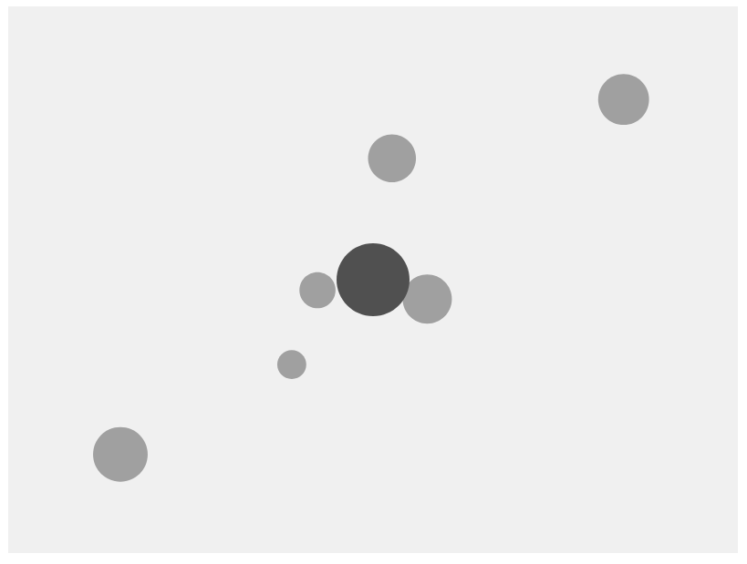

# Gravitational Force

## Simulating Gravitational Force between an Attractor ( the object that is stationary ) and multiple Movers ( the objects that are moving around ) 

## The Attractor object can be dragged with mouse to see change in Gravitational Force

## Live Demo [Click Here!!](https://thenirmalkc.github.io/gravitational-force/)

